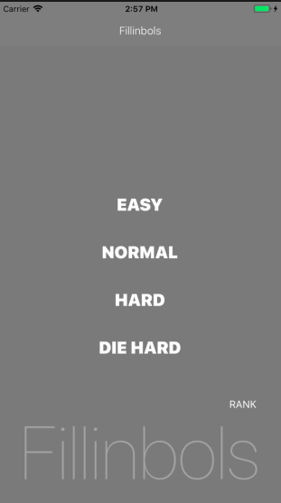

# Fillinbols





`Fillinbols` is a simple arithmetic calculation game for iOS.

## How to play
* User can select a level from EASY, NORMAL, HARD, and DIE HARD, which has different operator symbols according to each level, and see 10 fill-in calculations to answer by tapping on the symbols (That's why I named it Fillinbols!).
* There are obvious signs displaying tick or cross mark over fomulas, in order to check if the symbol user chose is correct or wrong.
* User would get scores when he answer correctly by left time for each calculation, or lose 1 point everytime he clicks on the wrong symbols.
* Each calculation has  seconds and next fomula shows up when time is up.
* After all calculations finished, user can get his final score. Congratulations!
* User will be asked for use name to display in the rank only when the score is in the top 5 of all the results (The results and user names are stored and shown only on his device. User can skip entering his name and default name will be saved if lazy). 
* Ok, it's time to start a new game.

## How it works
* Calculation types
    * EASY: 2 (addition / substraction)
    * NORMAL: 4 (addition / substraction / multiplication / division)
    * HARD: 5 (addition / substraction / multiplication / division /modulus)
    * DIE HARD: 5 + ⍺ (addition /substraction / multiplication / division / modulus + always added power)
* Calculation time per each calculation (seconds)
    * EASY: 3
    * NORMAL: 5
    * HARD: 7
    * DIE HARD: 8
* Final Score
    * Final score will be calculated as the sum of all the left time of the 10 calculations.
* Rank
    * Rank can be checked by user on the first interface or after games.
    * Rank displays top 5 game results for 4 levels, with user name and the level besides the score.
    * Input dialog shows up after game to let user enter his name when the score is above the 5th in the current rank.
    * All the data are saved on ONLY user's local device. NOT online.

## Installation
To play `Fillinbols`, clone the repository, open, the project in XCode, and click the run button.
```
$ git clone https://github.com/as-am-i/Fillinbols
```


